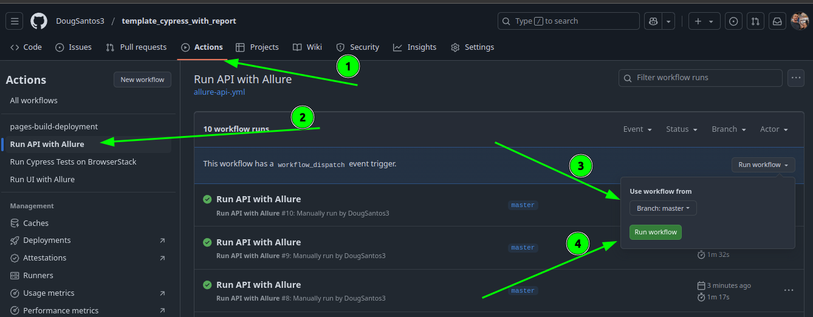
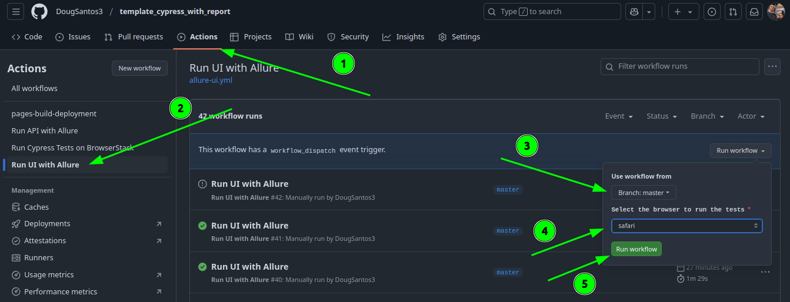
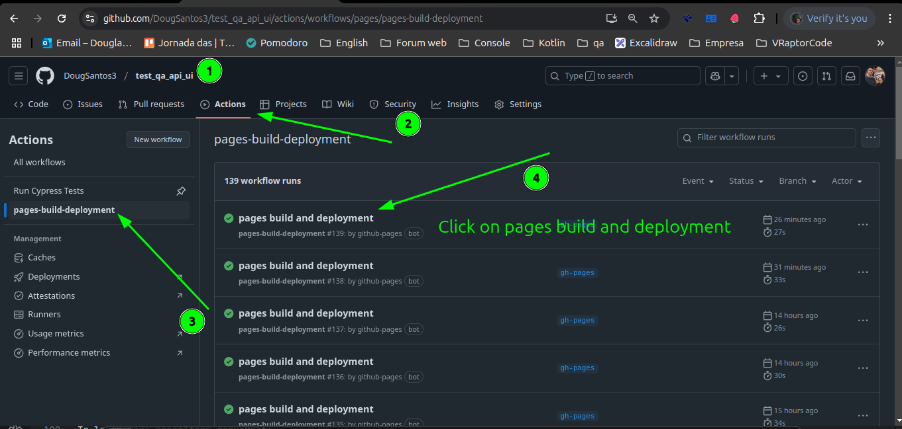
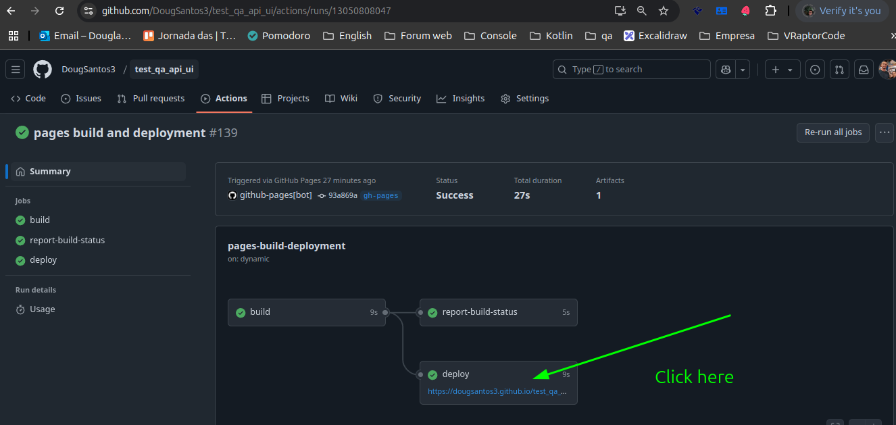
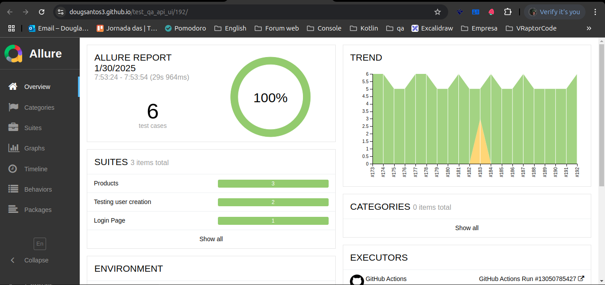

<h1 align="center">Automation with Cypress on ServeRest</h1>
<br />

<p style="display: flex; justify-content: center; gap: 10px;">


</p>
</div>

<br>
<br>

This is a Test QA - project using [`cypress`](https://www.cypress.io/).

## Getting Started

You need to download the packages:

```bash
# Node
v20.18.0 lts
```

```bash
# npm version: 11.0.0
# Download dependencies
npm install
```

Run tests:

```bash
# Open dashboard cypress
npm run open
```
```bash
# Run tests ui env qa in several browser
BROWSER=chrome npm run test:ui-allure 
BROWSER=edge npm run test:ui-allure 
BROWSER=firefox npm run test:ui-allure 
BROWSER=webkit npm run test:ui-allure 
BROWSER=electron npm run test:ui-allure

npm run test:api-allure
```
<br>

# View location on Allure Report

```bash
# After run test, create report. Use this command if you need to save the report for future reference or for sharing it with colleagues. With the error image of the failed test case attached to the report
npm run view:report
# Or use this command if you need to view the report for yourself and do not need to save it.  With the error image of the failed test case attached to the report
npm run server

# After running a test once, you can use the command npm run allure:history. Then, when you run the tests again, any new or differing results will be added, and trends will appear within the Allure report. This is beneficial because it allows you to view a graph displaying multiple executions, including both failed and successful tests.
npm run allure:history

# Delete allure folders and screenshots
npm run allure:clear
```
<br>

<br>


```bash
BROWSER=chrome npm run test:ui-mochawesome
BROWSER=edge npm run test:ui-mochawesome
BROWSER=firefox npm run test:ui-mochawesome
BROWSER=webkit  npm run test:ui-mochawesome
BROWSER=electron npm run test:ui-mochawesome

npm run test:api-mochawesome
```

# View location on Mochawesome Report

```bash
# After run test, create report. Use this command if you want to merge the json 
npm run mochawesome:merge

# After with this command you will create the html with all the reports
npm run mochawesome:generate

```

<br>

# Browserstack

### Before run Browserstack you need execute
`node generateConfig.js`

### Now you can run BrowserStack
`browserstack-cypress run`

<br>

# Details

- A mochawesome-report folder will be generated in the project root and you must enter it, look for the merged.html file where the report with the scenarios will be, just double-click on it.

- The system only has one environment where I left qa as default, but if the system has multiple environments, you just need to change the urls in cypress.config.js and call it via:

  NODE_ENV=dev npm run test:ui-allure

  NODE_ENV=dev npm run test:ui-mochawesome

  NODE_ENV=prod npm run test:ui-allure
  
  NODE_ENV=prod npm run test:ui-mochawesome

## Tests Overview

### API Tests

- Updating the user's email
- Shopping cart registration
- Removing a product
- Searching for a product
- Searching for a user (This last one includes a test for user search and also validates the API contract within the same test)

### UI Tests

- Product creation
- User creation
- Login

<br>


### Run GitHub Action
`Api`

<p align="center">
  
</p>

`Ui`
<p align="center">
  
</p>


#### After executing the scenarios, the report is generated in pages-build-deployment. It may happen that between one execution and another, GitHub takes some time to process the last execution. Please wait for a while.

<p align="center">
  
</p>

<p align="center">
  
</p>

<p align="center">
  
</p>


## Learn More

From the test application I have my postman collection with more automated scripts than the one that comes in the serverRest repository. Mine is more up to date:

colletion_postman/myCollection.postman_collection.json
<br>
colletion_postman/postman_environment.json

<br>

## Project that was tested

To learn more repository serveRest:

- Project tested UI [Serverest](https://front.serverest.dev/login)
- Project tested API [Serverest](https://serverest.dev/#/)
- [Repository ServeRest](https://github.com/ServeRest/ServeRest)


<br>

## More information

If you need to use automation to access the development database in scenarios where, after the automated test, the saved record needs to be deleted to avoid accumulating entries (since the automation handles this), or if you need to perform a SELECT to retrieve data for testing purposes or other scenarios, the project is already preconfigured to access the database. It even includes examples of queries within the commands file located at cypress/support/commands/database-commands.js.
